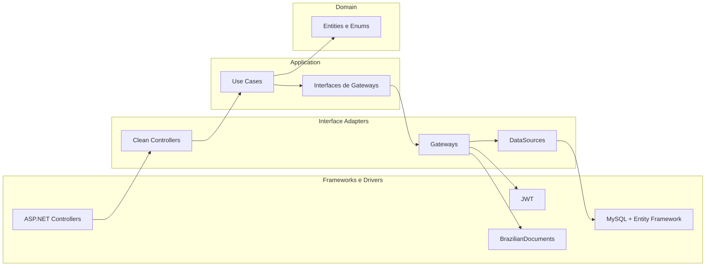
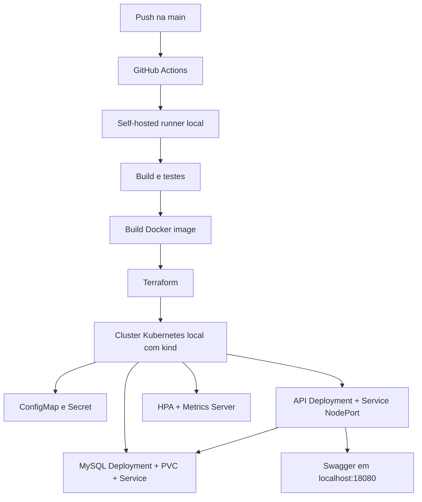

# Tech Challenge - Oficina Mecânica

Sistema integrado para gestão de oficina mecânica, desenvolvido como MVP de back-end para o Tech Challenge da pós-graduação.

# ---- Fase 2 ----

A Fase 2 adiciona a execução local com Kubernetes. A aplicação continua sendo a mesma API da oficina, mas agora ela pode ser executada em um cluster local com API, MySQL, ConfigMap, Secret, volume persistente, Service, HPA e Metrics Server.

## Decisão de infraestrutura

Para a Fase 2, foi escolhida uma execução local em vez de publicar a aplicação em uma cloud pública, como AWS.

Nesse modelo, o Docker Desktop fornece a engine Docker da máquina, e o Terraform provisiona um cluster Kubernetes local usando kind. 

Para a parte de CI/CD, a estratégia foi utilizar um self-hosted runner do GitHub Actions instalado na máquina local. Esse runner funciona como o servidor responsável por executar os passos da pipeline, como rodar testes, gerar a imagem Docker, criar ou atualizar o cluster local com Terraform e aplicar os manifests no Kubernetes.

Com isso, o fluxo da entrega fica assim:

```text
push na branch main
  -> GitHub Actions aciona a pipeline
  -> self-hosted runner local executa os comandos
  -> testes são executados
  -> imagem Docker da API é gerada
  -> Terraform provisiona o cluster Kubernetes local com kind
  -> Terraform aplica os manifests Kubernetes
  -> aplicação fica disponível em http://localhost:18080
```

## Arquitetura proposta

A aplicação foi organizada seguindo Clean Architecture. A regra principal é manter as regras de negócio independentes de frameworks: HTTP, Entity Framework, JWT, validador externo, Docker, Kubernetes e Terraform ficam nas camadas externas.



## Arquitetura de infraestrutura e deploy



## Artefatos de API

- Swagger local pelo Kubernetes: `http://localhost:18080/swagger/index.html`
- OpenAPI local pelo Kubernetes: `http://localhost:18080/swagger/v1/swagger.json`
- Collection Postman versionada: [`docs/postman/oficina-mecanica.postman_collection.json`](docs/postman/oficina-mecanica.postman_collection.json)

Para usar a collection, importe o arquivo no Postman. A variável `baseUrl` vem como `http://localhost:18080`; se estiver usando Docker Compose, troque para `http://localhost:8080`.

## O que existe na Fase 2

- `Dockerfile`: gera a imagem da API.
- `docker-compose.yml`: mantém o jeito antigo de subir a aplicação com Docker Compose.
- `infra/`: scripts Terraform para provisionar o cluster local e os recursos Kubernetes.
- `infra/manifests/`: manifests aplicados pelo Terraform como resources `kubectl_manifest`.
- `k8s/`: guarda os manifests Kubernetes usados como referência e execução manual.
- `k8s/kustomization.yaml`: lista todos os arquivos Kubernetes que devem ser aplicados juntos.
- `k8s/api-deployment.yaml`: define como o pod da API deve rodar.
- `k8s/api-service.yaml`: expõe a API para acesso local em `http://localhost:18080`.
- `k8s/mysql-deployment.yaml`: define como o pod do MySQL deve rodar.
- `k8s/mysql-service.yaml`: cria o endereço interno do MySQL dentro do cluster.
- `k8s/mysql-pvc.yaml`: cria o volume persistente usado pelo MySQL.
- `k8s/configmap.yaml`: guarda configurações não sensíveis da aplicação.
- `k8s/secret.yaml`: guarda valores sensíveis, como senha do banco e chave JWT.
- `k8s/api-hpa.yaml`: configura o autoscaling da API.
- `k8s/metrics-server.yaml`: instala o Metrics Server para o HPA conseguir ler CPU e memória.
- `docs/postman/`: collection completa para consumo das APIs.


## Pré-requisitos

Antes de rodar pela Fase 2, é necessário ter:

- Docker Desktop instalado.
- Docker Desktop rodando.
- Terraform instalado.
- `kubectl` disponível no terminal.
- `.NET SDK` instalado apenas se quiser rodar os testes localmente fora do Docker.

Para o fluxo com Terraform e kind, não é necessário habilitar o Kubernetes do Docker Desktop. O Terraform cria o cluster local usando containers Docker.

## Como rodar com Terraform

Execute os comandos abaixo na raiz do projeto.

### Comandos do zero

```bash
docker build -t oficina-mecanica-api:local .
cd infra
terraform init
terraform apply
```

Depois abra:

```text
http://localhost:18080/swagger/index.html
```

O comando abaixo e opcional para a aplicacao funcionar, mas necessario se voce quiser consultar o cluster com `kubectl` no terminal:

```bash
export KUBECONFIG="$(pwd)/.terraform/oficina-mecanica-kubeconfig"
```

### 1. Gerar a imagem Docker da API

```bash
docker build -t oficina-mecanica-api:local .
```

Esse comando lê o `Dockerfile`, compila a aplicação e cria uma imagem local chamada `oficina-mecanica-api:local`.

Essa imagem é a que o Kubernetes vai usar para criar o pod da API.

### 2. Entrar na pasta de infraestrutura

```bash
cd infra
```

Essa pasta contém os arquivos Terraform responsáveis pela infraestrutura local.

### 3. Inicializar o Terraform

```bash
terraform init
```

Esse comando baixa os providers usados pelo projeto:

- `tehcyx/kind`, para criar o cluster Kubernetes local;
- `gavinbunney/kubectl`, para aplicar manifests YAML como resources do Terraform.

### 4. Ver o plano de execução

```bash
terraform plan
```

Esse comando mostra o que o Terraform pretende criar antes de aplicar qualquer mudança.

### 5. Aplicar a infraestrutura

```bash
terraform apply
```

Esse comando cria o cluster Kubernetes local com kind, carrega a imagem da API dentro do cluster e aplica os manifests Kubernetes.

Na prática, ele cria ou atualiza:

- cluster Kubernetes local
- namespace da aplicação
- configurações
- secrets
- MySQL
- volume do MySQL
- API
- services
- HPA
- Metrics Server

### 6. Configurar o kubectl para o cluster criado

```bash
export KUBECONFIG="$(pwd)/.terraform/oficina-mecanica-kubeconfig"
```

Esse comando faz o `kubectl` apontar para o cluster local criado pelo Terraform. Ele nao e necessario para a API funcionar; serve apenas para comandos de consulta e administracao, como `kubectl get pods`, `kubectl logs` e `kubectl exec`.

### 7. Verificar os recursos

```bash
kubectl get nodes
kubectl get pods -n oficina-mecanica
kubectl get service -n oficina-mecanica
kubectl get hpa -n oficina-mecanica
```

Esses comandos mostram o node do cluster, os pods da aplicação, os services e o autoscaling.

O MySQL usa `ClusterIP`, porque só precisa ser acessado de dentro do cluster pela API.

A API usa `NodePort` dentro do cluster kind. O cluster kind faz o mapeamento:

```text
localhost:18080 -> NodePort 30080 -> API:8080
```

### 8. Acessar a API

Depois que os pods estiverem `Running`, acesse:

```text
http://localhost:18080/swagger/index.html
```

Esse endereço abre o Swagger da API rodando no Kubernetes local.

## Como rodar depois de alterar código

Quando alterar código C#, gere uma nova imagem:

```bash
docker build -t oficina-mecanica-api:local .
```

Depois entre em `infra/` e recarregue a imagem no cluster:

```bash
cd infra
terraform apply -replace=terraform_data.load_api_image
```

O `docker build` cria a imagem nova. O `terraform apply -replace=terraform_data.load_api_image` força o Terraform a carregar novamente essa imagem dentro do cluster kind.

Depois reinicie o deployment da API:

```bash
export KUBECONFIG="$(pwd)/.terraform/oficina-mecanica-kubeconfig"
kubectl rollout restart deployment/oficina-mecanica-api -n oficina-mecanica
```

Para acompanhar a recriação do pod:

```bash
kubectl rollout status deployment/oficina-mecanica-api -n oficina-mecanica
```

## Pipeline CI/CD local

As pipelines ficam separadas em dois workflows:

- `.github/workflows/integracao-continua.yml`: integração contínua;
- `.github/workflows/entrega-continua.yml`: entrega contínua.

O workflow de integração contínua roda em pull requests para a `main` e em pushes na `main`.

Ele executa:

- build da solução;
- testes automatizados.

O workflow de entrega contínua roda quando o workflow de integração contínua termina com sucesso na `main`.

Ele executa:

- build da imagem Docker da API;
- `terraform init`;
- `terraform validate`;
- `terraform plan`;
- `terraform apply`;
- recarregamento da imagem `oficina-mecanica-api:local` no cluster kind;
- reinício controlado do deployment da API;
- validação dos recursos Kubernetes;
- validação do Swagger em `http://localhost:18080/swagger/index.html`.

Como o deploy é local, a pipeline usa `runs-on: self-hosted`. O runner precisa estar instalado na máquina local e a máquina precisa ter Docker Desktop rodando, Terraform e `kubectl` disponíveis.

O checkout das pipelines usa `clean: false` para preservar os arquivos locais ignorados pelo Git, como `.terraform/` e `terraform.tfstate`, que representam o estado da infraestrutura local gerenciada pelo Terraform.

### Como configurar o self-hosted runner

No GitHub, abra o repositorio e entre em:

```text
Settings -> Actions -> Runners -> New self-hosted runner
```

Escolha o sistema operacional da maquina local e siga os comandos mostrados pelo GitHub. Depois de configurar, deixe o runner em execucao com o comando indicado pela propria tela do GitHub, normalmente:

```bash
./run.sh
```

O runner precisa aparecer como `Idle` ou `Online` no GitHub antes de fazer push na `main`. Como os workflows usam `runs-on: self-hosted`, se o runner estiver desligado a pipeline fica aguardando uma maquina disponivel.

### Como validar a pipeline

Depois que o runner estiver online, faca push na `main`.

O fluxo esperado e:

```text
Integracao continua
  -> Build
  -> Test

Entrega continua
  -> Build API Docker image
  -> Terraform apply infrastructure
  -> Reload API image in kind
  -> Restart API deployment
  -> Validate Kubernetes resources
  -> Validate API endpoint
```

## Como ver logs

Para ver logs da API:

```bash
kubectl logs deployment/oficina-mecanica-api -n oficina-mecanica
```

Para ver logs do MySQL:

```bash
kubectl logs deployment/mysql -n oficina-mecanica
```

## Como acessar o banco no Kubernetes

O MySQL não fica exposto diretamente para fora do cluster. Para acessar o banco, entre no pod pelo `kubectl exec`:

```bash
kubectl exec -it deployment/mysql -n oficina-mecanica -- mysql -uoficina_user -poficina_pass oficina_mecanica
```

Dentro do MySQL, para listar as tabelas:

```sql
SHOW TABLES;
```

Para sair:

```sql
exit;
```

## Como verificar o HPA

O HPA é o recurso que escala a API automaticamente quando CPU ou memória passam do limite configurado.

Para verificar:

```bash
kubectl get hpa -n oficina-mecanica
```

Para ver o consumo atual dos pods:

```bash
kubectl top pods -n oficina-mecanica
```

Para ver o consumo do node:

```bash
kubectl top nodes
```

O comando `kubectl top` depende do Metrics Server. No fluxo Terraform, ele fica em `infra/manifests/`.

## Como remover o ambiente Kubernetes

Para remover os recursos criados pelos manifests:

```bash
cd infra
terraform destroy
```

Atenção: esse comando remove os recursos Kubernetes e o cluster kind criado localmente.

## Resumo do fluxo da Fase 2

```bash
docker build -t oficina-mecanica-api:local .
cd infra
terraform init
terraform apply
```

Para inspecionar com `kubectl`:

```bash
export KUBECONFIG="$(pwd)/.terraform/oficina-mecanica-kubeconfig"
kubectl get pods -n oficina-mecanica
kubectl get service -n oficina-mecanica
```

Depois abra:

```text
http://localhost:18080/swagger/index.html
```

# ---- Fase 1 ----

Sistema integrado para gestão de oficina mecânica, desenvolvido como MVP de back-end para o Tech Challenge da pós-graduação.

## Objetivo

O projeto atende os principais requisitos da fase 1:

- CRUD de clientes
- CRUD de veículos
- CRUD de serviços
- CRUD de peças e insumos com controle de estoque
- Criação e acompanhamento de ordens de serviço
- Geração automática de orçamento
- Aprovação, recusa, cancelamento, finalização e entrega da OS
- Consulta pública de OS do cliente por CPF/CNPJ
- Monitoramento do tempo médio de execução
- Autenticação JWT para APIs administrativas
- Documentação da API via Swagger
- Testes unitários e de integração

## Stack utilizada

- ASP.NET Core 10
- Entity Framework Core
- MySQL 8.4
- Docker e Docker Compose
- xUnit
- Swagger 

## Justificativa do banco de dados

O banco de dados escolhido foi o MySQL.

Essa escolha foi feita pelos seguintes motivos:

- familiaridade prévia com a tecnologia, reduzindo a curva de aprendizado e acelerando a implementação do MVP
- suporte adequado ao modelo relacional necessário para clientes, veículos, serviços, peças e ordens de serviço
- integração simples com o Entity Framework Core por meio do provider utilizado no projeto
- facilidade de execução em ambiente Docker, ajudando a padronizar a configuração e a reprodução do sistema em outras máquinas


## Estrutura do projeto

- `OficinaMecanica.Api/`: aplicação principal
- `OficinaMecanica.Api/OficinaMecanica.Api.UnitTests/`: testes unitários
- `OficinaMecanica.Api/OficinaMecanica.Api.IntegrationTests/`: testes de integração
- `docker-compose.yml`: ambiente completo com API e banco

## Como executar

Na raiz do projeto, execute:

```bash
docker compose up --build
```

O ambiente sobe:

- API em `http://localhost:8080`
- Swagger em `http://localhost:8080/swagger`
- MySQL em `localhost:3306`

As migrations são aplicadas automaticamente na inicialização da API.

Para encerrar o ambiente:

```bash
docker compose down
```


## Swagger

O Swagger foi mantido como documentação e teste manual dos endpoints.

URL:

```text
http://localhost:8080/swagger
```

## Autenticação JWT

As APIs administrativas exigem autenticação JWT.

Endpoint de login:

```http
POST /api/auth/login
```

Credenciais padrão:

```json
{
  "username": "admin",
  "password": "Admin@123"
}
```

Após o login, utilize o token retornado no header:

```http
Authorization: Bearer {token}
```

Observação:

- o Swagger está configurado principalmente como documentação;
- para testar rotas autenticadas, o caminho mais simples é usar Postman;
- o Postman pode importar a especificação OpenAPI por:

```text
http://localhost:8080/swagger/v1/swagger.json
```

## Rotas principais

### Autenticação

- `POST /api/auth/login`

### Clientes

- `GET /api/clientes`
- `GET /api/clientes/{id}`
- `POST /api/clientes`
- `PUT /api/clientes/{id}`
- `DELETE /api/clientes/{id}`

### Veículos

- `GET /api/veiculos`
- `GET /api/veiculos/{id}`
- `POST /api/veiculos`
- `PUT /api/veiculos/{id}`
- `DELETE /api/veiculos/{id}`

### Serviços

- `GET /api/servicos`
- `GET /api/servicos/{id}`
- `POST /api/servicos`
- `PUT /api/servicos/{id}`
- `DELETE /api/servicos/{id}`

### Peças e insumos

- `GET /api/pecas`
- `GET /api/pecas/{id}`
- `POST /api/pecas`
- `PUT /api/pecas/{id}`
- `DELETE /api/pecas/{id}`

### Ordens de serviço

- `GET /api/ordensservico`
- `GET /api/ordensservico?status={status}&ordenacao={maisAntigo|maisNovo}`
- `GET /api/ordensservico/{id}`
- `GET /api/ordensservico/tempo-medio-execucao`
- `GET /api/ordensservico/cliente/{cpfCnpj}`
- `POST /api/ordensservico`
- `POST /api/ordensservico/{id}/iniciar-diagnostico`
- `POST /api/ordensservico/{id}/enviar-orcamento`
- `POST /api/ordensservico/{id}/aprovar-orcamento`
- `POST /api/ordensservico/{id}/recusar-orcamento`
- `POST /api/ordensservico/{id}/notificacao-orcamento`
- `POST /api/ordensservico/{id}/cancelar`
- `POST /api/ordensservico/{id}/finalizar`
- `POST /api/ordensservico/{id}/entregar`

## Fluxo principal da OS

### 1. Abertura da OS com cliente e veiculo existentes

O atendente pode abrir a OS usando um cliente e um veiculo ja cadastrados.

- `cpfCnpj`
- `veiculoId`
- `servicoIds`
- `pecasInsumos`

Exemplo:

```json
{
  "cpfCnpj": "45513451808",
  "veiculoId": "6963ed70-0133-414b-9a8e-7a85f3a67a9c",
  "servicoIds": [
    "ac668df9-b051-4fbb-8207-8098a7a0ad25"
  ],
  "pecasInsumos": [
    {
      "pecaInsumoId": "91edc7cb-0e36-44ed-8f88-2b8e3037575c",
      "quantidade": 1
    }
  ]
}
```

### 2. Abertura da OS com cliente e veiculo novos

Tambem e possivel abrir a OS ja criando o cliente e o veiculo na mesma chamada.

Exemplo:

```json
{
  "cliente": {
    "nome": "Cliente OS",
    "cpfCnpj": "52998224725",
    "email": "cliente.os@email.com",
    "telefone": "11977777777"
  },
  "veiculo": {
    "placa": "BRA2E19",
    "marca": "Honda",
    "modelo": "Civic",
    "ano": 2023
  },
  "servicoIds": [
    "ac668df9-b051-4fbb-8207-8098a7a0ad25"
  ],
  "pecasInsumos": [
    {
      "pecaInsumoId": "91edc7cb-0e36-44ed-8f88-2b8e3037575c",
      "quantidade": 1
    }
  ]
}
```

Status inicial:

- `Recebida`

### 3. Início do diagnóstico

Endpoint:

```http
POST /api/ordensservico/{id}/iniciar-diagnostico
```

Status:

- `EmDiagnostico`

### 4. Envio do orçamento

O mecânico informa serviços e peças/insumos após o diagnóstico.

Exemplo:

```json
{
  "servicoIds": [
    "ac668df9-b051-4fbb-8207-8098a7a0ad25"
  ],
  "pecasInsumos": [
    {
      "pecaInsumoId": "91edc7cb-0e36-44ed-8f88-2b8e3037575c",
      "quantidade": 1
    }
  ]
}
```

Endpoint:

```http
POST /api/ordensservico/{id}/enviar-orcamento
```

Comportamento:

- inclui serviços e peças na OS
- calcula o orçamento automaticamente
- registra envio simulado do orçamento ao cliente
- altera o status para `AguardandoAprovacao`

### 5. Aprovação ou recusa administrativa

Aprovar:

```http
POST /api/ordensservico/{id}/aprovar-orcamento
```

Status:

- `EmExecucao`

Recusar:

```http
POST /api/ordensservico/{id}/recusar-orcamento
```

Status:

- `EmDiagnostico`

### 6. Notificação externa de aprovação ou recusa

Esse endpoint representa uma chamada externa, por exemplo um sistema/link de aprovação do cliente. Ele nao exige JWT.

Endpoint:

```http
POST /api/ordensservico/{id}/notificacao-orcamento
```

Aprovação:

```json
{
  "aprovado": true
}
```

Recusa:

```json
{
  "aprovado": false,
  "motivoRecusa": "Cliente solicitou revisao do valor"
}
```

Quando aprovado, o status muda para `EmExecucao`. Quando recusado, o status volta para `EmDiagnostico`.

### 7. Listagem das ordens de serviço

Endpoint:

```http
GET /api/ordensservico?status=Recebida&ordenacao=maisAntigo
```

Parametros opcionais:

- `status`: `Recebida`, `EmDiagnostico`, `AguardandoAprovacao`, `EmExecucao`, `Finalizada`, `Entregue` ou `Cancelada`
- `ordenacao`: `maisAntigo` ou `maisNovo`

Regras aplicadas:

- ordena por prioridade de status: `EmExecucao`, `AguardandoAprovacao`, `EmDiagnostico`, `Recebida`
- dentro do mesmo status, usa a data de criacao
- por padrao, mostra as mais antigas primeiro
- nao lista OS `Finalizada`, `Entregue` ou `Cancelada`

### 8. Cancelamento

```http
POST /api/ordensservico/{id}/cancelar
```

Status:

- `Cancelada`

### 9. Finalização

```http
POST /api/ordensservico/{id}/finalizar
```

Status:

- `Finalizada`

### 10. Entrega

```http
POST /api/ordensservico/{id}/entregar
```

Status:

- `Entregue`

## Regras importantes do sistema

- cliente identificado por `CPF/CNPJ`
- veículo associado a cliente
- `CPF/CNPJ` de cliente não pode duplicar
- placa de veículo validada com biblioteca específica
- `CPF/CNPJ` validado com algoritmo real
- orçamento calculado automaticamente com base nos serviços e peças
- envio de orçamento é simulado, sem integração real com e-mail
- apenas rotas administrativas exigem JWT
- notificacao externa de orçamento nao exige JWT
- listagem de OS nao retorna ordens finalizadas, entregues ou canceladas
- consulta do cliente pode ser feita por:
  - `GET /api/ordensservico/cliente/{cpfCnpj}`


### Todos os testes
Os testes podem ser executados na raiz do repositório.
```bash
dotnet test 
```

### Apenas testes unitários

```bash
dotnet test OficinaMecanica.Api.UnitTests/OficinaMecanica.Api.UnitTests.csproj
```

### Apenas testes de integração

```bash
dotnet test OficinaMecanica.Api.IntegrationTests/OficinaMecanica.Api.IntegrationTests.csproj 
```


## Banco de dados

O MySQL pode ser acessado em:

- host: `localhost`
- porta: `3306`
- database: `oficina_mecanica`
- user: `oficina_user`
- password: `oficina_pass`

Pelo terminal pode rodar: docker compose exec mysql mysql -uoficina_user -poficina_pass oficina_mecanica

## SonarQube

Para gerar o relatório de qualidade do código com SonarQube:

1. Suba o SonarQube na raiz do repositório:

```bash
docker compose -f ../docker-compose.sonar.yml up -d
```

2. Acesse:

```text
http://localhost:9000
```

3. Faça login no SonarQube com:

- usuário: `admin`
- senha: `Admin@123456`

4. Gere um token de acesso no SonarQube.

5. Na pasta da API, exporte o token:

```bash
export SONAR_TOKEN="seu_token_aqui"
```

6. Execute a análise:

```bash
bash scripts/sonar_scan.sh
```

## OWASP ZAP

Para gerar o relatório de segurança da aplicação em execução com OWASP ZAP:

1. Garanta que a aplicação esteja rodando em:

```text
http://localhost:8080
```

2. Na pasta da API, execute:

```bash
bash scripts/zap_scan.sh
```

O script realiza:

- login na API para obter o JWT administrativo
- import da especificação OpenAPI
- scan automatizado da API com ZAP
- geração dos relatórios em:

```text
zap-report/zap-report.html
zap-report/zap-report.json
zap-report/zap-report.xml
```

Observações:

- o script usa as credenciais administrativas padrão da aplicação:
  - usuário: `admin`
  - senha: `Admin@123`
- se essas credenciais mudarem, podem ser sobrescritas antes da execução:

```bash
export ADMIN_USERNAME="admin"
export ADMIN_PASSWORD="nova_senha"
bash scripts/zap_scan.sh
```

- por padrão, o script usa:
  - `http://localhost:8080` para o login feito pela máquina host
  - `http://host.docker.internal:8080` para o acesso do container do ZAP à API


## Observações

- o envio de orçamento é simulado
- para testes autenticados, o Postman tende a oferecer a melhor experiência
