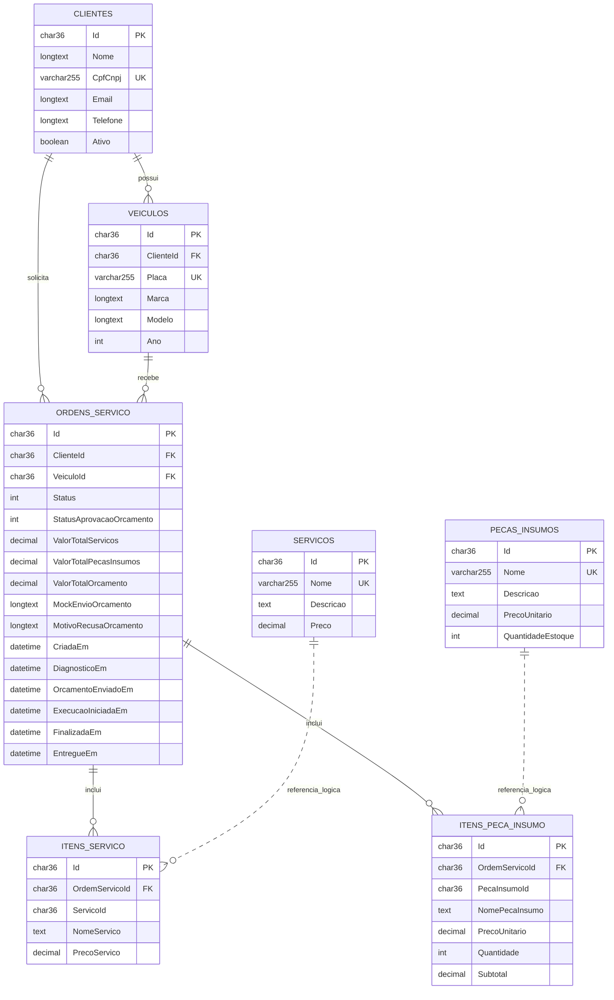

# Banco de dados e modelo relacional

## Decisao

Foi escolhido o Amazon RDS for MySQL 8.4 como banco gerenciado. A escolha e
formalizada na [RFC-002](../rfcs/RFC-002-banco-relacional-gerenciado.md).

O dominio da oficina e transacional e possui relacionamentos claros entre
clientes, veiculos, ordens, servicos e pecas. A abertura e a evolucao de uma OS
precisam manter integridade referencial e consistencia de valores e estoque.
Por isso, um banco relacional e mais adequado que um armazenamento orientado a
documentos para este MVP.

O RDS elimina a administracao do processo MySQL e oferece persistencia
gerenciada. A instancia nao e publica, fica em sub-redes privadas e recebe
conexoes apenas dos Security Groups do EKS e da Lambda.

As migrations pertencem a aplicacao principal, pois representam a evolucao do
modelo persistido pelo codigo. No inicio do pod, o Entity Framework aplica as
migrations pendentes antes de a API receber trafego.

## Diagrama ER

Linhas continuas representam chaves estrangeiras fisicas. Linhas pontilhadas
representam referencias logicas preservadas nos itens da OS.

## Relacionamentos

| Relacionamento | Cardinalidade | Regra |
|---|---|---|
| Cliente e Veiculo | 1:N | Um cliente pode possuir varios veiculos; cada veiculo pertence a um cliente. |
| Cliente e Ordem de Servico | 1:N | Toda OS possui exatamente um cliente; um cliente pode solicitar varias OS. |
| Veiculo e Ordem de Servico | 1:N | Toda OS trata exatamente um veiculo; o mesmo veiculo pode retornar em varias OS. |
| Ordem e Item de Servico | 1:N | Uma OS pode conter varios servicos; os itens sao removidos em cascata com a OS. |
| Ordem e Item de Peca/Insumo | 1:N | Uma OS pode consumir varias pecas; cada item registra quantidade e subtotal. |
| Catalogo e itens da OS | referencia logica | O ID identifica a origem, enquanto nome e preco sao copiados para preservar o orcamento mesmo se o catalogo mudar depois. |

## Integridade e indices

- `Clientes.CpfCnpj`, `Veiculos.Placa`, `Servicos.Nome` e
  `PecasInsumos.Nome` possuem indices unicos.
- As chaves estrangeiras de cliente, veiculo e itens impedem registros orfaos.
- A exclusao de relacionamentos dependentes usa cascata conforme as migrations.
- `Cliente.Ativo` permite que a autenticacao serverless negue acesso sem apagar
  fisicamente o cadastro.
- Datas de transicao da OS permitem calcular tempo de execucao, enquanto os
  eventos de log registram o tempo gasto em cada etapa para o dashboard.

## Disponibilidade e recuperacao

Para reduzir custo no ambiente academico, a configuracao usa uma unica
instancia e nao habilita Multi-AZ. Em producao real, a evolucao recomendada e
habilitar Multi-AZ, backups com retencao maior, Performance Insights e rotacao
de credenciais em um gerenciador de segredos.
