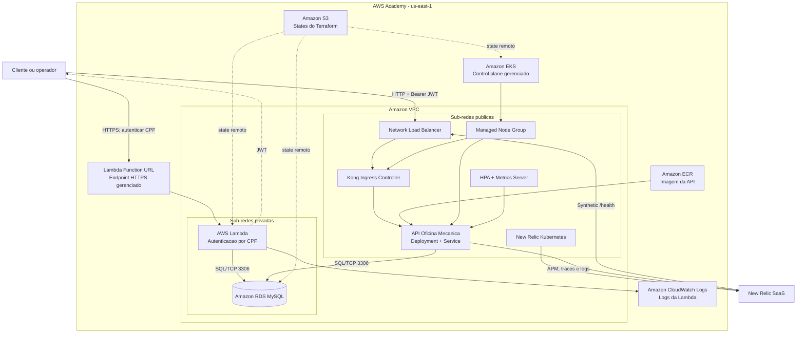

# Diagrama de componentes de nuvem

O diagrama mostra apenas servicos executados ou gerenciados em nuvem e as
integracoes externas necessarias para observar e consumir o sistema. A
organizacao interna da Clean Architecture esta documentada no README principal.

## Responsabilidades

| Componente | Responsabilidade | Repositorio proprietario |
|---|---|---|
| S3 | Armazenar os states remotos separados do Terraform | infraestrutura de banco |
| VPC, sub-redes e Security Groups | Isolar rede e permitir somente os fluxos necessarios | infraestrutura de banco, Kubernetes e Lambda |
| RDS MySQL | Persistir os dados transacionais da oficina | infraestrutura de banco |
| EKS e Managed Node Group | Executar os workloads Kubernetes | infraestrutura Kubernetes |
| ECR | Armazenar a imagem imutavel da API | infraestrutura Kubernetes |
| Kong e Network Load Balancer | Formar o unico ponto de entrada da API e validar JWT | infraestrutura Kubernetes e aplicacao |
| API, Service e HPA | Executar os casos de uso e escalar os pods | aplicacao principal |
| Lambda e Function URL | Autenticar cliente ativo por CPF e emitir JWT | autenticacao serverless |
| CloudWatch Logs | Reter logs estruturados da Lambda por sete dias | autenticacao serverless |
| New Relic | APM, logs, traces, Kubernetes, uptime, alertas e dashboard | Kubernetes e aplicacao principal |

## Limites de rede

- O RDS possui `publicly_accessible = false` e fica nas sub-redes privadas.
- O Service da API e `ClusterIP`; ele nao possui endereco publico proprio.
- O Kong e o unico Service Kubernetes do tipo `LoadBalancer`.
- O Security Group do RDS aceita a porta 3306 somente dos Security Groups dos
  nodes do EKS e da Lambda.
- A Function URL e um endpoint HTTPS gerenciado fora das sub-redes. A funcao se
  conecta as sub-redes privadas para acessar o RDS; seu handler aceita somente
  `POST`, valida o CPF e nunca retorna informacoes de clientes inativos.
