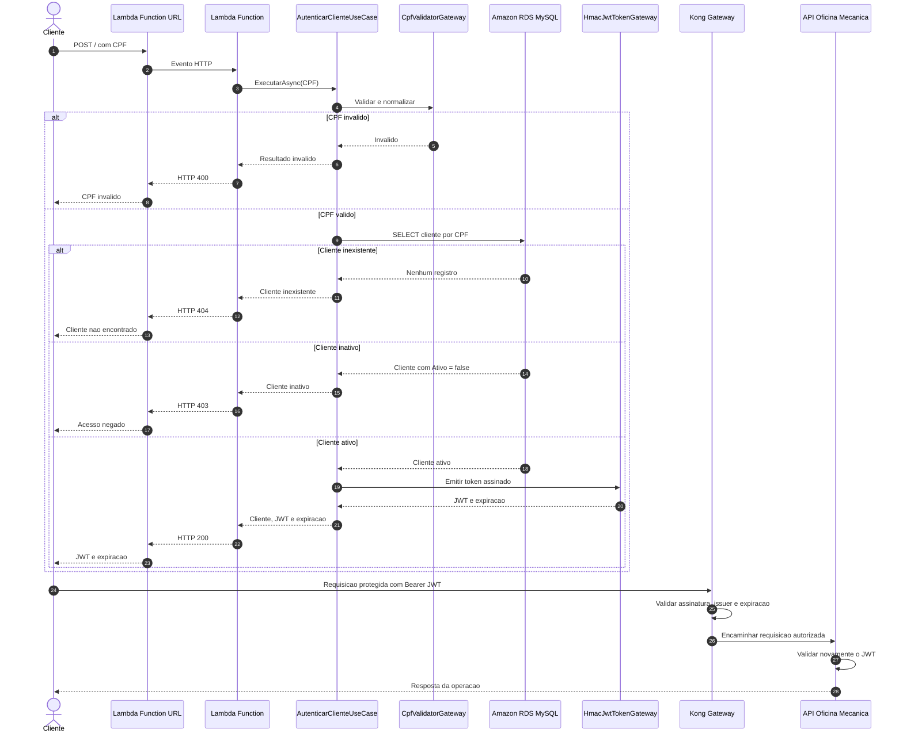
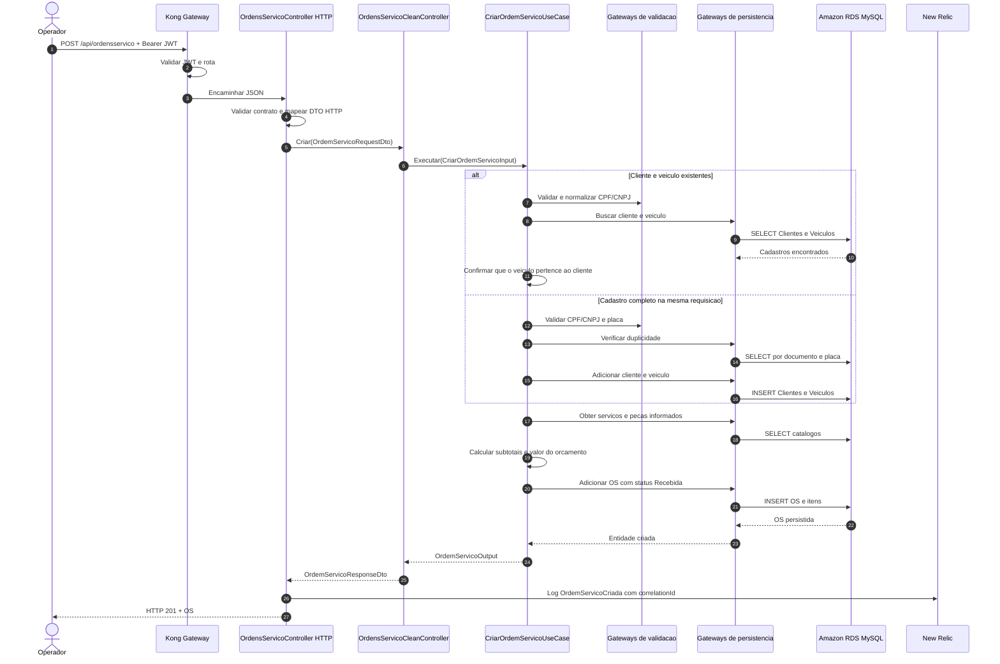

# Diagramas de sequencia

## Autenticacao de cliente por CPF

O JWT e assinado pela Lambda com o mesmo segredo, issuer e audience usados pelo
Kong e pela API. Isso evita uma chamada remota da API para a Lambda em cada
requisicao e preserva duas barreiras de validacao.

## Abertura de ordem de servico

O controller HTTP conhece ASP.NET e formatos de transporte. O controller Clean
adapta DTOs para inputs e outputs da aplicacao. O caso de uso concentra as
regras de abertura e depende apenas das interfaces de gateway.
